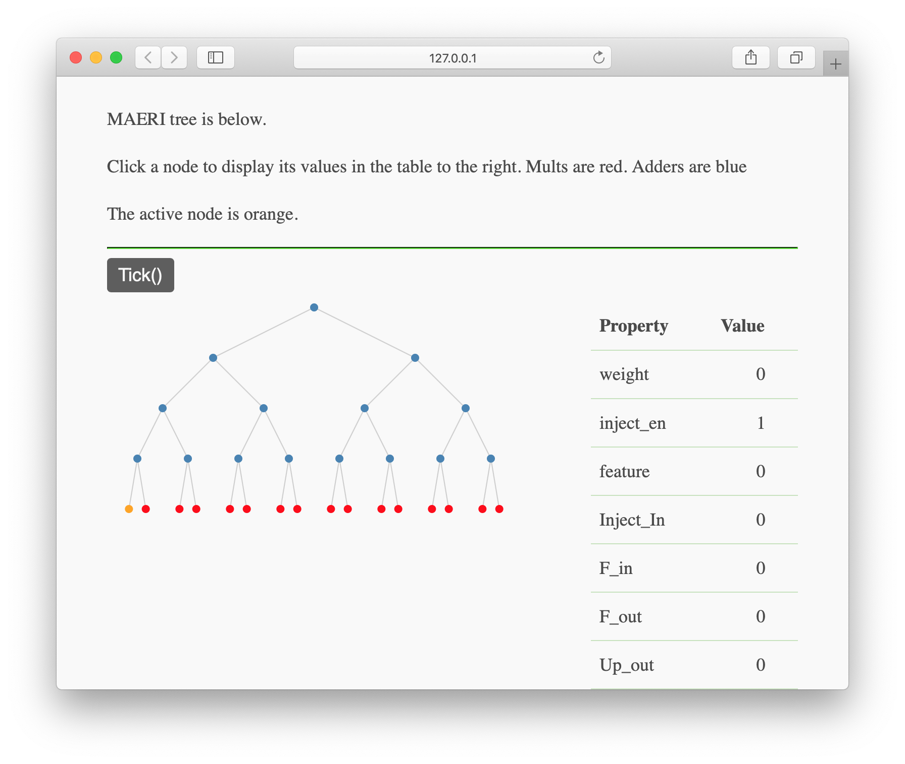
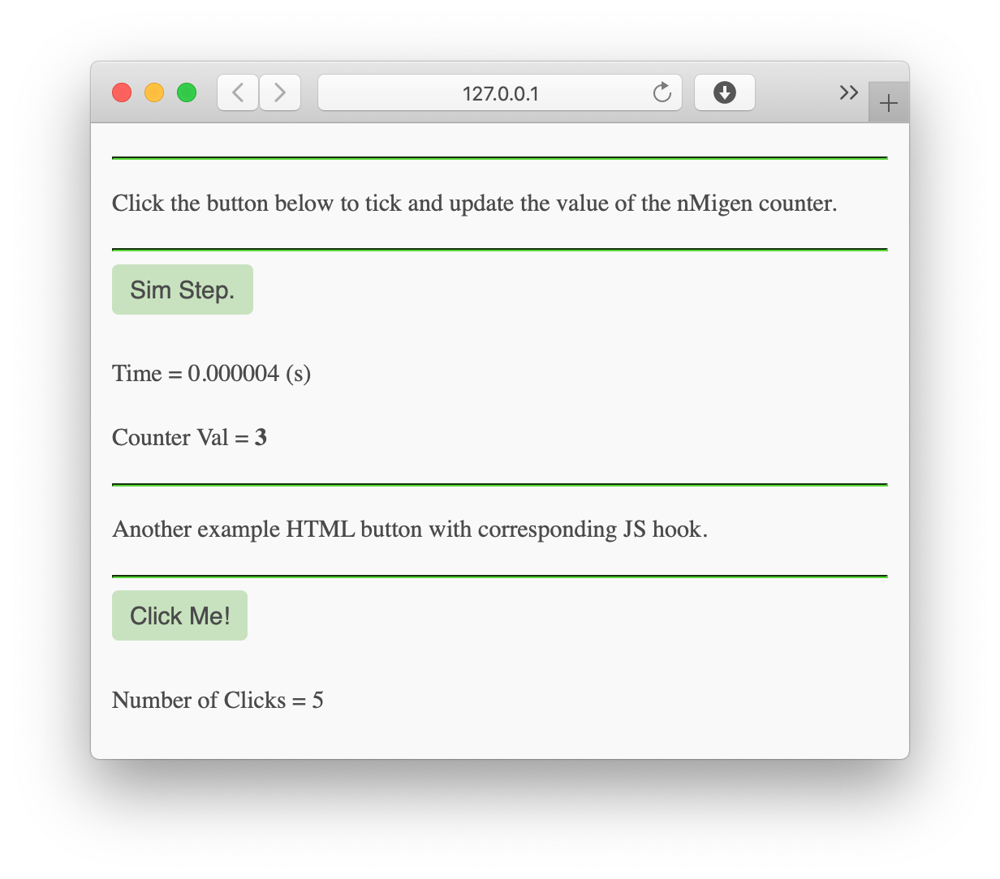

# nMigen Simulator Visualiser

This repository provides a skeleton as well as some
demo code demonstrating how to visualise the state
of an nMigen simulation with some javascript.

The code is lightweight and implements updates with
callbacks whenever a button is clicked.

Below is a fantastic example of visualising
the internal state of the [nMigen ML accelerator
MAERIV6](https://github.com/BracketMaster/MAERIV6).



[What is nMigen?](#what-is-nmigen)

Sometimes you have very complicated RTL that is
an implementation of a regular structure such as
a tree or a butterfly DSP chain.

Debugging might be much easier if you could simply
draw your butterfly DSP chain with values in boxes
instead of browsing waveforms or using print statements.

Behold! The nMigen Visualiser. It utilises a flask
server which calls into the nmigen simulator.
You can put a javascript frontend using ``d3.js``
or perhaps ``vis.js``that can grab the values from
flask and render a drawing for you.

An added bonus, a visualising simulator may 
also serve as a good form of documentation
in the future.

# Running the Demo

This code here is primarily meant to serve as a starting 
point for other projects.

An nMigen counter is instantiated and its value is drawn
on a webpage. Clicking ``Step Sim`` advances the simulation.

## Steps

You may want to do the following steps in 
a python virtual environment.

```bash
git clone https://github.com/BracketMaster/nmigen_visualiser
cd nmigen_visualiser
python setup.py develop
python demo/counter_tb.py
```

You should now be able to run the demo 
shown in the picture below.



# Extending and Re-using
You will first need to install ``nmigen_visualiser``
on your system like so:

```bash
pip3 install git+https://github.com/BracketMaster/nmigen_visualiser
```

You can copy the ``./demo`` directory and use it as
a standalone starting point wherever you'd like.

## Creating The Visualiser
Once you have setup your nMigen simulation object,
instead of doing:

```python
sim.add_sync_process(process)
sim.run()
```

You can do:

```python
visual_sim = VisInterface(
    sim = sim,
    html = html,
    js = js,
    get_state=get_state,
    # makes the current file title the browser tab title
    title = __file__[:-3]
    )

visual_sim.run_sync(process)
```

Sim is your nMigen simulator object.

``html`` and ``js`` are strings containing the frontend
html and js.

You can take a look in ``demo/counter_tb.py`` to see that
``frontend.html`` and ``frontend.js`` are opened as text files
and read into the ``html`` and ``js`` string objects.

``get_state`` is a generator function that whose last yield is a
string object that represents the state of some signals of interest
in the simulation at that instant in time.

It might make sense to have ``get_state`` yield a ``json`` 
string which would allow for easier parsing from the javascript
side of things.

Note that the ``get_state`` function is only allowed to yield
objects of type ``Signal`` with the exception of its last yield
statement which must be of type ``str``.

This of course means that you cannot yield ``Tick`` or ``Settle``
as these commands would advance the simulation in some manner,
violating the purpose ``get_state`` function which is merely
meant to observe the simulation without affecting its state.

## Adding Actions
You may wish for your frontend to have more buttons
that toggle on and off certain parts of the visualisation.
This can be accomplished by adding html form buttons
to ``./demo/frontend/frontend.html``.

Check out the ``click_me`` button in
``./demo/frontend/frontend.html``, and 
the corresponding ``function click()``
in ``./demo/frontend/frontend.js``.

The buttons can trigger functions in the javascript
located in ``./demo/frontend/frontend.js``.

The flask server has a predefined ``tick`` action that
causes the simulation to progress. An example of how to 
access ``tick`` is included in ``./demo/frontend/frontend.js``
with the corresponding button in ``./demo/frontend/frontend.html``.

## Augmenting Visualisation
You can access the ``payload.state`` variable in the
javascript frontend and do whatever you want with it.

For example, you could iterate over it and pass it
into ``d3.js`` to make a fancy graph.


# What is [nMigen](https://github.com/nmigen/nmigen)?
nMigen is an RTL implemented as a Python DSL.

It has the following strengths:

 - Emits Yoysys RTLIL
 - Emits veilog through Yosys RTLIL
 - Clean interface to FOSS SymbiYosys formal verification suite.
 - Clean and natural idioms.
 - Built in Python RTL Simulator
 - Will soon be capable of using the speedy YosysCXX simulator backend
 - Allows for anything Python enabling sane management of large codebases
   - Unit tests
   - list comprehensions
   - the list goes on...
 - nMigen SOC comes with nice tools such as Wishbone.

# TODO
 - [x] break HTML script into separate ``js`` file
 - [x] move counter_tb into demo folder
 - [x] modularize with setup.py
 - [x] instructions for modifying for your needs
 - [x] callbacks instead of polling
 - [ ] replace CSS with actual files
