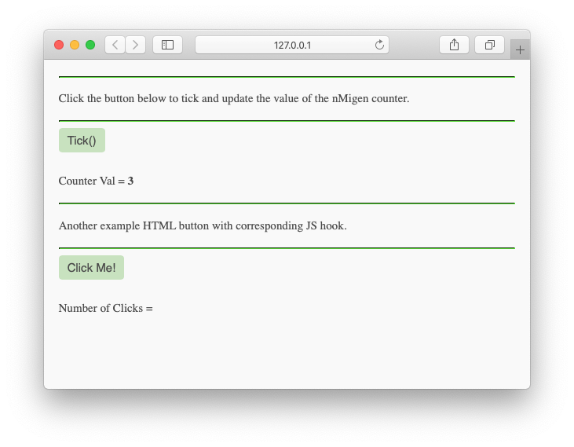

# nMigen Simulator Visualiser



[What is nMigen?](#what-is-nmigen)

Sometimes you have very complicated RTL that is
an implementation of a regular structure such as
a tree or a butterfly DSP chain.

Debugging might be much easier if you could simply
draw your butterfly DSP chain with values in boxes
instead of browsing waveforms or using print statements.

Behold! The nMigen Visualiser. It utilises a flask
server which calls into the nmigen simulator.
You can put a javascript frontend using ``d3.js``
or perhaps ``vis.js``that can grab the values from
flask and render a drawing for you.

An added bonus, a visualising simulator may 
also serve as a good form of documentation
in the future.

# Running the Demo

This code here is primarily meant to serve as a starting 
point for other projects.

An nMigen counter is instantiated and its value is drawn
on a webpage. Clicking ``Step Sim`` advances the simulation.

## Steps

You may want to do the following steps in 
a python virtual environment.

```bash
git clone https://github.com/BracketMaster/nmigen_visualiser
cd nmigen_visualiser
python setup.py develop
python demo/counter_tb.py
```

You should now be able to run the demo 
in the intro picture of this README.

# Extending and Re-using
You will first need to install ``nmigen_visualiser``
on your system like so:

```bash
pip3 install git+https://github.com/BracketMaster/nmigen_visualiser
```

You can copy the ``./demo`` directory and use it as
a standalone starting point wherever you'd like.

## Accessing State in Javascript
Any information you wish to visualise must be passed in
as a python dict object, a list, or a single value to
the ``nmigen_visualiser.update_state()`` function.

The information will be converted to a ``json`` object
and will be accessible as an object of the ``payload.state``
object.

For the current timestamp, ``payload.ticks`` is already provided
to the javascript frontend.

## Adding Actions
You may wish for your frontend to have more buttons
that toggle on and off certain parts of the simulation.
This can be accomplished by adding html form buttons
to ``./demo/frontend/frontend.html``.

The buttons can trigger functions in the javascript
located in ``./demo/frontend/frontend.js``.

## Augmenting Visualisation
You can access the ``payload.state`` variable in the
javascript frontend and do whatever you want with it.

For example, you could iterate over it and pass it
into ``d3.js`` to make a fancy graph.


# What is [nMigen](https://github.com/nmigen/nmigen)?
nMigen is an RTL implemented as a Python DSL.

It has the following strengths:

 - Emits Yoysys RTLIL
 - Emits veilog through Yosys RTLIL
 - Clean interface to FOSS SymbiYosys formal verification suite.
 - Clean and natural idioms.
 - Built in Python RTL Simulator
 - Will soon be capable of using the speedy YosysCXX simulator backend
 - Allows for anything Python enabling sane management of large codebases
   - Unit tests
   - list comprehensions
   - the list goes on...
 - nMigen SOC comes with nice tools such as Wishbone.

# TODO
 - [ ] break HTML script into separate ``js`` file
 - [ ] move counter_tb into demo folder
 - [ ] modularize with setup.py
 - [ ] instructions for modifying for your needs
 - [ ] replace CSS with actual files